# 一、特征点

## 1.特征点概述

特征点就是图像当中具有代表性的部分。

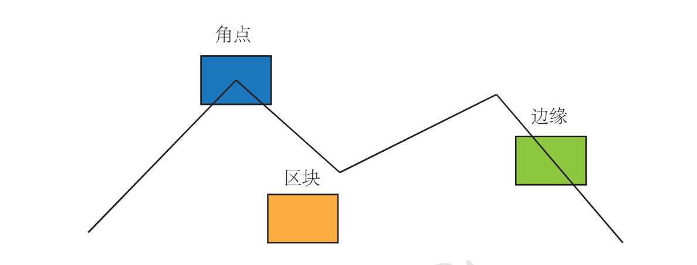

#### 特征点的特点
* 可重复性：相同的”区域“可以在不同的图像中被找到
* 可区别性：不同的“区域”有不同的表达
* 高效性：同一图像中特征点的数目远小于像素数目
* 本地性：特征点仅与一小片区域有关

#### 特征点的信息
位置、大小、方向、评分等——关键点
特征点周围的图像信息——描述子（Descriptor）

特征描述子的不变性主要体现在两个方面：

* 尺度不变性 Scale Invarient
    
指的是同一个特征，在图像的不同的尺度空间保持不变。匹配在不同图像中的同一个特征点经常会有图像的尺度问题，不同尺度的图像中特征点的距离变得不同，物体的尺寸变得不同，而仅仅改变特征点的大小就有可能造成强度不匹配。如果描述子无法保证尺度不变性，那么同一个特征点在放大或者缩小的图像间，就不能很好的匹配。为了保持尺度的不变性，在计算特征点的描述子的时候，通常将图像变换到统一的尺度空间，再加上尺度因子。

* 旋转不变性 Rotation Invarient

指的是同一个特征，在成像视角旋转后，特征仍然能够保持不变。和尺度不变性类似，为了保持旋转不变性，在计算特征点描述子的时候，要加上关键点的方向信息。

## 2.SIFT算法特征点
SIFT的全称是Scale Invariant Feature Transform（尺度不变特征变换）。
* 关键点：
建立的高斯金字塔与高斯差分金字塔，通过比较像素点与当前图层周围8个像素与同一尺度下上下两图片中相同位置2*9个像素是否为极值来判断改点是否为关键点。通过计算周围像素点梯度的幅值与梯度方向，对通过幅角范围将周围像素划分到不同的直方图中，最高柱体的方向为特征点主方向，最高柱体的80%高度的方向作为特征点的辅助方向。一个特征点可能检测到多个方向（也可以理解为，一个特征点可能产生多个坐标、尺度相同，但是方向不同的特征点）。

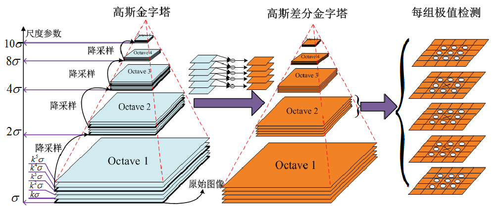

* 描述子：以特征点为中心，在附近邻域内将坐标轴旋转特征点的主方向的角度，以关键点为中心取 8×8的窗口。每4*4的像素作为一个窗口，求取每个像素的梯度幅值与梯度方向，箭头方向代表该像素的梯度方向，长度代表梯度幅值，然后利用高斯窗口对其进行加权运算。最后在每个4×4的小块上绘制8个方向的梯度直方图，计算每个梯度方向的累加值，形成有8个方向的向量信息。最终描述子以4*4*8的向量组成。

!

#### SIFT算法主要有以下几个步骤：

    1.高斯差分金字塔的构建
    使用组和层的结构构建了一个具有线性关系的金字塔（尺度空间），这样可以在连续的高斯核尺度上查找图像的特征点；另外，它使用一阶的高斯差分来近似高斯的拉普拉斯核，大大的减少了运算量。
    2.尺度空间的极值检测及特征点的定位
    搜索上一步建立的高斯尺度空间，通过高斯差分来识别潜在的对尺度和旋转不变的特征点。但是，在离散空间中，局部极值点可能并不是真正意义的极值点，真正的极值点有可能落在离散点的间隙中，SIFT通过尺度空间DoG函数进行曲线拟合寻找极值点。
    3.特征方向赋值
    基于图像局部的梯度方向，分配给每个关键点位置一个或多个方向，后续的所有操作都是对于关键点的方向、尺度和位置进行变换，从而提供这些特征的不变性。
    4.特征描述子的生成
    通过上面的步骤已经找到的SIFT特征点的位置、方向、尺度信息，最后使用一组向量来描述特征点及其周围邻域像素的信息。

SIFT算法中及包含了特征点的提取算法，也有如何生成描述子的算法，更进一步的SIFT算法介绍可参看
[特征点匹配——SIFT算法详解](https://blog.csdn.net/lhanchao/article/details/52345845)
[Sift算子特征点提取、描述及匹配全流程解析](https://blog.csdn.net/dcrmg/article/details/52577555)

####优点
具有对图像缩放，平移，旋转不变的特征，对于光照、仿射和投影变换也有一定的不变性。

####缺点
运算速度慢

##3. FAST特征点提取算法
FAST全称为：Features From Accelerated Segment Test。在FAST算法的思想很简单：如果一个像素与周围邻域的像素差别较大（过亮或者过暗），那么可以认为该像素是一个角点。

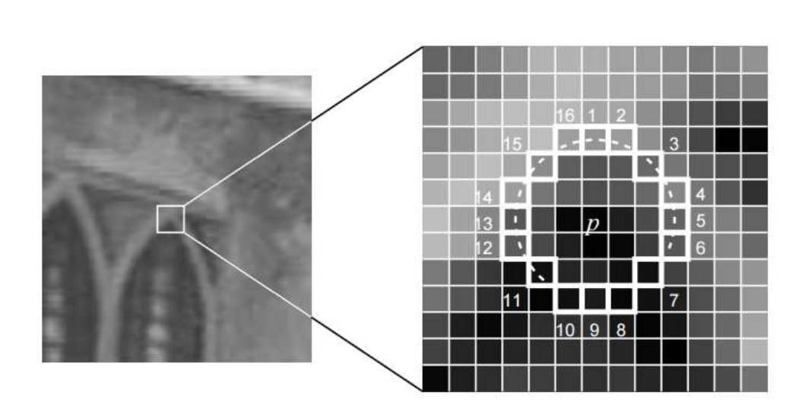

##### FAST算法提取角点的步骤：
* 在图像中选择像素p，假设其灰度值为：Ip。
* 设置一个阈值T，例如：Ip的20%。
* 选择p周围半径为3的圆上的16个像素，作为比较像素。
* 假设选取的圆上有连续的N个像素大于Ip+T或者Ip−T，那么可以认为像素p就是一个特征点。（N通常取12，即 为FAST-12；常用的还有FAST-9,FAST-11）。

#### 优点
FAST算法只检测像素的灰度值，其运算速度极快。

#### 缺点
检测到的特征点过多并且会出现“扎堆”的现象。这可以在第一遍检测完成后，使用非最大值抑制（Non-maximal suppression），在一定区域内仅保留响应极大值的角点，避免角点集中的情况。FAST提取到的角点没有方向和尺度信息

## 3.ORB特征

* 关键点：Oriented FAST
* 描述：BRIEF

#### 关键点：Oriented FAST
Oriented FAST添加了尺度和旋转的描述，尺度不变由构建金字塔，并在每一层金字塔检测交点。特征的旋转由灰度质心法实现。

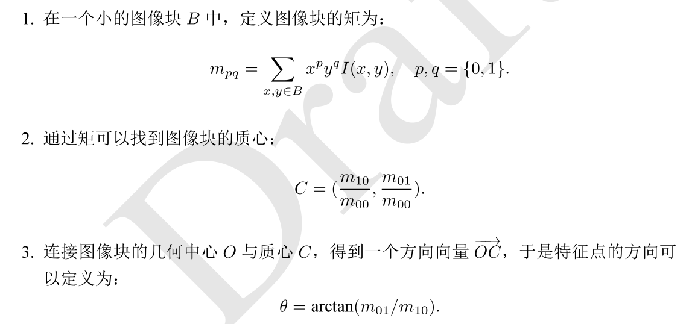

#### BRIEF描述子

BRIEF是一种二进制的描述子，其描述向量是0和1表示的二进制串。0和1表示特征点邻域内两个像素（p和q）灰度值的大小：如果p比q大则选择1，反正就取0。在特征点的周围选择128对这样的p和q的像素对，就得到了128维由0，1组成的向量。那么p和q的像素对是怎么选择的呢？通常都是按照某种概率来随机的挑选像素对的位置。
不同的patton有不同的取法：

!()[./image/8.png)

这里给出一种patton：

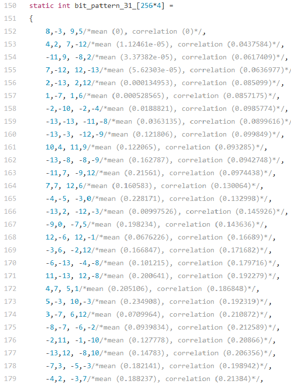

#### 缺点
相对SIFT描述子不变性较差。

#### 优点
具有方向与尺度不变性，计算速度快。

# 三、光流
光流描述了像素在图像中的运动

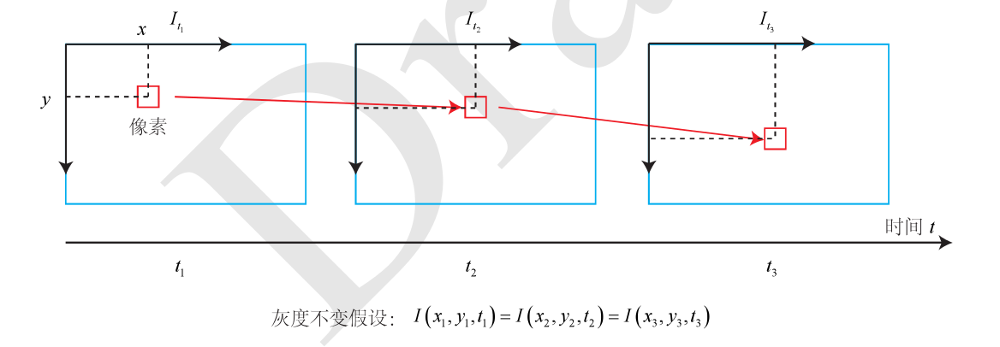

### 1. 分类
光流一般分为稀疏光流和稠密光流

#### 假设
基于光流法研究有三个前提假设：
（1）相邻帧之间的亮度恒定；
（2）相邻视频帧的取帧时间连续，或者，相邻帧之间物体的运动比较“微小”；
（3）保持空间一致性；即同一小窗口的像素点具有相同的运动 

#### 稀疏光流
稀疏光流只计算部分像素在不同图像中的运动，稀疏以Lucas-Kanade（LK）光流为代表。
设t时刻位于$(x,y)$处的像素灰度为$I(x,y)$,
$t+dt$时刻位置为$(x+dt,y+dt)$的像素灰度为$I(x+dt,y+dt)$
依假设条件有：

$$I(x+dx,y+dy,t+dt)=I(x,y,t)$$

泰勒展开，有： 

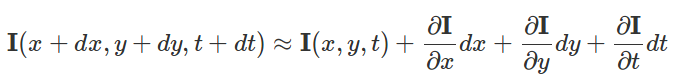

依据灰度不变假设有：

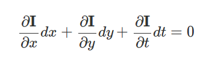

整理得：

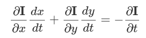

记：

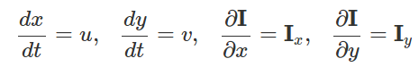

写成矩阵有

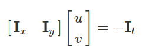

这是一个带有两个变量的一次方程，只有一个点是无法计算u和v.
依据假设一个窗口内的像素具有相同的运动。假设窗口大小为$w×w$, 则有$w^2$个像素，所以共有$w^2$个方程

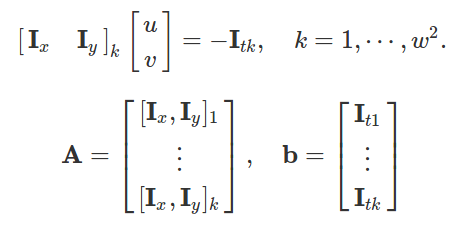

方程变为：

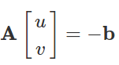

最小二乘解：

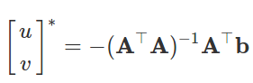

#####注解：
* 可以看成最小化像素误差的非线性优化
* 每次使用了Taylor一阶近似，在离优化点较远时效果不佳，往往需要迭代多次
* 运动较大时要使用金字塔
* 可以用于跟踪图像中的稀疏关键点的运动轨迹
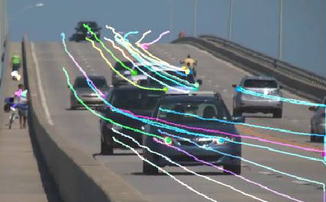

#### 稠密光流
稠密光流计算所有像素在不同图像中的运动，稠密以Horn–Schunck（HS）光流为代表。

